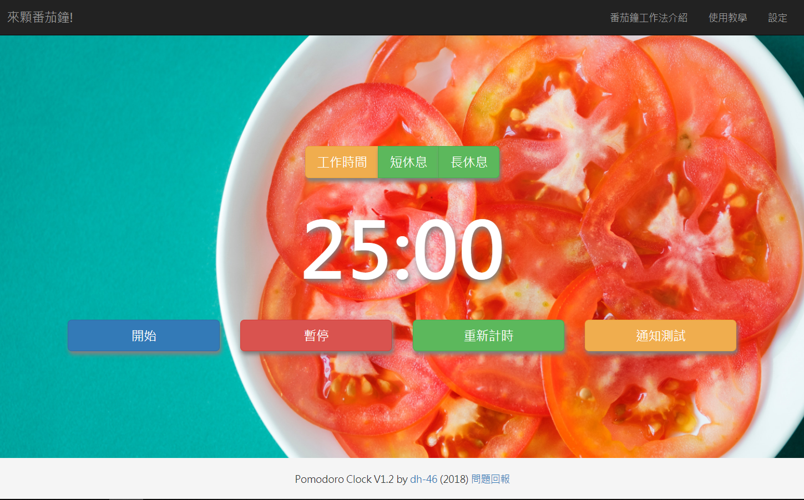

# 前端小專題: 來顆番茄鐘 (網頁倒數計時器)

## 功能
- 在倒數結束時發出桌面通知與音樂提醒使用者. 
- 使用者可自訂工作/長休息/短休息三種不同模式的時間.
- 預設提供三種音樂讓使用者自訂提示鈴聲.
- 除基本的網頁對話框提示, 也提供桌面通知功能.
- 網址列提供倒數時間讀秒
- 網頁背景輪播
- 設定是否自動循環計時(四段工作後一個長休息)
- 鈴聲音量調整
- 問題回報: Google表單

## 預想使用者流程:
- 使用者進入網頁後, 選擇工作時間與休息時間,點選開始功能開始倒數計時
- 時間到後跳出桌面通知, 通知關閉後預設自動開始休息時間倒數.
- 休息時間結束後, 跳出視窗恭喜使用者完成工作, 並自動繼續下一個工作.
    
## 運用技術:

1. HTML5&CSS3
2. Bootstrap 3.3.7
3. JavaScript
4. jQuery
   
## 畫面截圖:

## 參考資料來源: 
- [Tomato-Timer](https://tomato-timer.com/)  
- [番茄鐘工作法： 25 分鐘改變效率的 10 個番茄鐘工具](https://www.playpcesor.com/2015/01/pomodoro-time-manager-top-10-app.html)
- [維基百科: 番茄鐘工作法](https://zh.wikipedia.org/wiki/%E7%95%AA%E8%8C%84%E5%B7%A5%E4%BD%9C%E6%B3%95)
- [Notification API](https://developer.mozilla.org/en-US/docs/Web/API/Notifications_API/Using_the_Notifications_API)     
